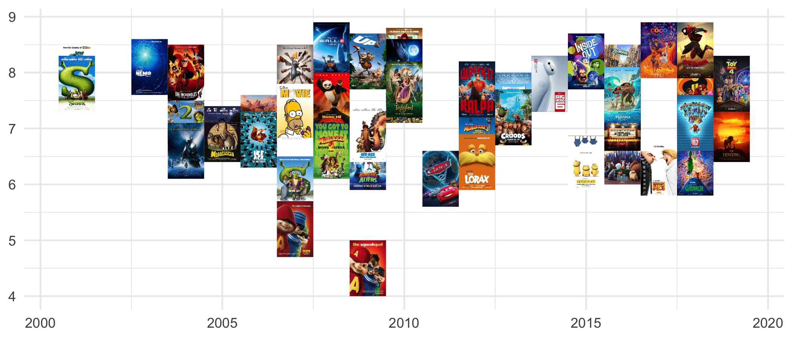
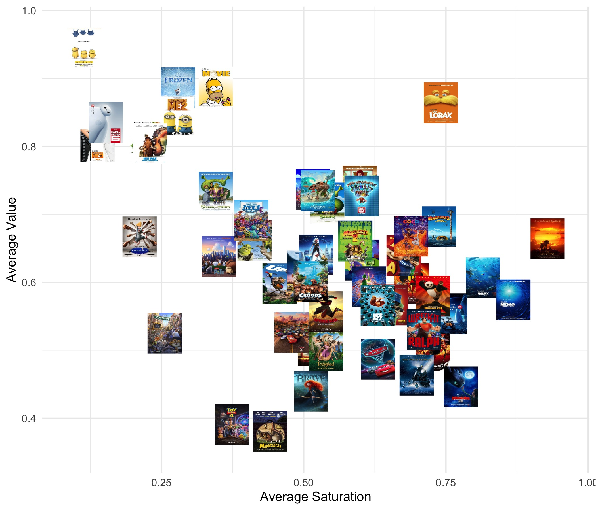

# ggimg: The Missing Image Primitive for ggplot2

## Installation

The package is currently only available on GitHub and can be installed with

```{r}
remotes::install_github("statsmaths/ggimg")
```

It is planned to submit the package to CRAN by the end of the month
(March 2020).

## Overview

The **ggplot2** R package provides over 50 types of geometry layers, with many
of these internally built up from a small set of primitive graphic types such
as `geom_polygon` and `geom_rect`. Putting these elements together provides
the ability to create a wide variety of data visualizations. Curiously, however,
there is currently no default layer for displaying a collection of images.
The function `geom_raster` allows one to displaying a grid *as* an image and
`annotation_raster` makes it possible to add a single to a plot. But what if
we have an image associated with each row of our dataset and want to display
these on the plot? Some other packages, such as **ggimage**, provide a complete
set of functions for working with images, however they require additional
external dependencies and are not convenient for quick tinkering, hands-on
workshops, or as dependencies for other packages.

The package **ggimg** provides a single new geometry, `geom_img`,
that displays one image for each row in the corresponding dataset. It has five
required aesthetics and one optional aesthetics as follows:

- **xmin**, **xmax**, **ymin**, **ymax**: Coordinates of a bounding box in which
to display the image.
- **img**: the image to display. Either be a local path to a PNG or JPEG
file, a URL starting with "http", or the raster image already as a matrix or
array with 1-4 color channels.
- **alpha**: Desired opacity of the image. Images can contain a native alpha
component,  which will be used if alpha is a negative number (the default).
If alpha is negative and no alpha channel is present, an alpha value of 1 is
assumed.

There are many possibilities for extending the package to deal with other
image types, different ways of defining the image region (height and width;
max/min dimension for preserving aspect ratios), and many kinds of image
preprocessing that can be done. However, as mentioned above, this package for
the moment is intended to only provide a low-level interface that can be easily
maintained in used in down-stream scripts and packages. For example, check out
my package [ggmaptile](https://github.com/statsmaths/ggmaptile) which uses
`geom_img` to display slippy map tiles underneath geospatial datasets.

## Example Usage

As an example of how to use the `geom_img` layer, we will use some data about
the 50 highest grossing animated U.S. films and their movie posters. The data
is included in this GitHub repository, and should work as written if you have
cloned the repository. Unfortunately, the data are a bit too large to include
with the package itself, particularly as it is intended to be a good lightweight
drop-in dependency for other projects.

To start, we read in the dataset, which includes one row for each movie along
with a path to the movie poster and some additional metadata.

```{r}
posters <- readr::read_csv(file.path("examples", "poster_animation.csv"))
dplyr::select(posters, year, title, img, stars)
```
```
# A tibble: 50 x 4
    year title                 img                                         stars
   <dbl> <chr>                 <chr>                                       <dbl>
 1  2018 Incredibles 2         examples/images/2018_incredibles_2.jpg        7.6
 2  2019 The Lion King         examples/images/2019_the_lion_king.jpg        6.9
 3  2016 Finding Dory          examples/images/2016_finding_dory.jpg         7.3
 4  2004 Shrek 2               examples/images/2004_shrek_2.jpg              7.2
 5  2019 Toy Story 4           examples/images/2019_toy_story_4.jpg          7.8
 6  2010 Toy Story 3           examples/images/2010_toy_story_3.jpg          8.3
 7  2013 Frozen                examples/images/2013_frozen.jpg               7.5
 8  2003 Finding Nemo          examples/images/2003_finding_nemo.jpg         8.1
 9  2016 The Secret Life of P… examples/images/2016_the_secret_life_of_pe…   6.5
10  2013 Despicable Me 2       examples/images/2013_despicable_me_2.jpg      7.3
# … with 40 more rows
```

Let's plot the year each film was released along the x-axis and its score on
IMDb on the y-axis. We will set the height and with of the images to be one unit
by off-setting the year and stars variable by plus or minus one half.

```{r}
library(ggplot2)
library(ggimg)

ggplot(posters) +
  geom_img(aes(
    xmin = year - 0.5,
    xmax = year + 0.5,
    ymin = stars - 0.5,
    ymax = stars + 0.5,
    img = img
  )) +
  theme_minimal()
```



The output looks nice without much more work! Notice that because our layer
does not have an explicit 'x' or 'y' variable axis labels need to be input
manually with `labs`, if needed.

## A Longer Example

As a more flexible option, we can instead load the images into R directly and
store them as a list column in our dataset. This allows us to do all kinds of
pre- and post-processing, working with different data types, and showing images
that are created or modified within R. As an example, we can read our movie
posters into R using the `readJPEG` function:

```{r}
library(jpeg)

posters$img_array <- lapply(
  posters$img, function(path) readJPEG(path)
)
```

Here, to show more of the things that are made possible with the library,
we convert each image into its hue, saturation, and value and extract the
average saturation (how rich the colors look) and value (how bright the image
is).

```{r}
posters$hsv <- lapply(
  posters$img_array, function(img) {
    rgb2hsv(
      as.numeric(img[,,1]),
      as.numeric(img[,,2]),
      as.numeric(img[,,3]),
      maxColorValue = 1
    )
  }
)

posters$avg_sat <- sapply(posters$hsv, function(mat) mean(mat[2,]))
posters$avg_val <- sapply(posters$hsv, function(mat) mean(mat[3,]))
```

And then we will put this into our `geom_img` by passing the img_array parameter
to the img aesthetic.

```{r}
ggplot(posters) +
  geom_img(aes(
    xmin = avg_sat - 0.03,
    xmax = avg_sat + 0.03,
    ymin = avg_val - 0.03,
    ymax = avg_val + 0.03,
    img = img_array
  )) +
  theme_minimal() +
  labs(x = "Average Saturation", y = "Average Value")
```


