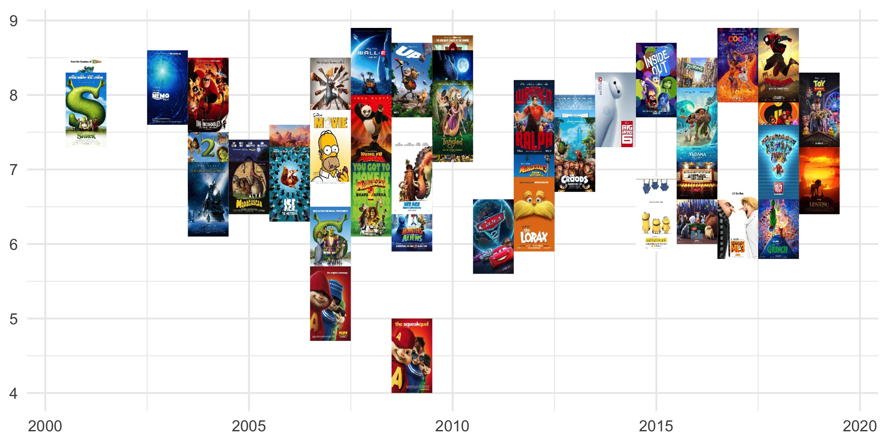
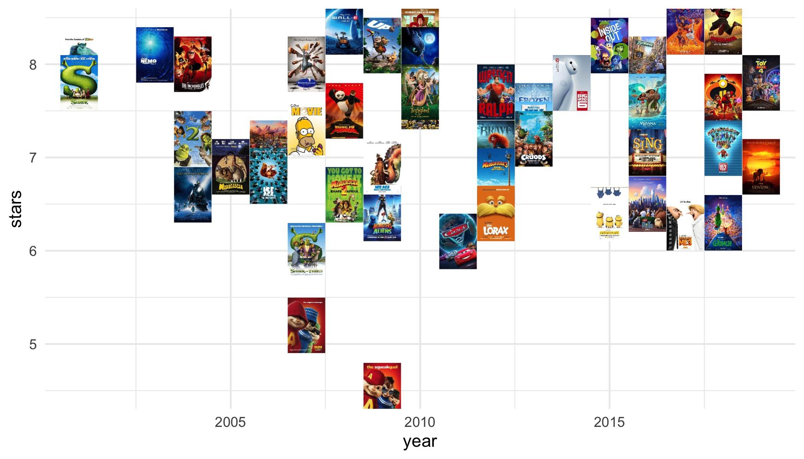

# ggimg: Missing Image Primitives for ggplot2

**Author:** Taylor B. Arnold<br/>
**License:** [GPL-2](https://opensource.org/licenses/GPL-2.0)

[](https://CRAN.R-project.org/package=ggimg) [](https://travis-ci.org/statsmaths/ggimg) 
[](https://codecov.io/gh/statsmaths/ggimg?branch=master)

## Installation

The package is currently available on CRAN and can be downloaded with:

```{r}
install.packages("ggimg")
```

The current development version can alternatively be installed directly from
GitHub:

```{r}
remotes::install_github("statsmaths/ggimg")
```

More information about package and how to use it are given in the descriptions
below.

## Overview

The package **ggimg** provides two new geometries, `geom_rect_img` and
`geom_point_img`, that display one image for each row in the corresponding
dataset. They function similarly to `geom_rect` and `geom_point`, but have an
additional aesthetic "img" that specifies the image to display for each row
in one of three ways:

- local paths to a PNG or JPEG file
- URLs starting with "http" or "https" pointing to an external PNG or JPEG image
- raster images as a list column containing matrices or arrays with 1-4 color
channels

There are many possibilities for extending the package to deal with other
image types, different ways of defining the image region and many kinds of image
preprocessing that can be done. However, as mentioned above, this package for
the moment is intended to only provide a low-level interface that can be easily
maintained in used in down-stream scripts and packages. For example, check out
my package [ggmaptile](https://github.com/statsmaths/ggmaptile) which uses
`geom_rect_img` to display slippy map tiles underneath geospatial datasets.

## A Simple Example

As an example of how to use the `geom_rect_img` layer, we will use some data
about the 50 highest grossing animated U.S. films and their movie posters. The
data is included with the package, along with a thumbnail image of each movie's
poster.

To start, we read in the dataset, which includes one row for each movie along
with a path to the movie poster and some additional metadata. We will also add
a column containing the full path to the images, which are installed in the
same location as the package.

```{r}
library(ggimg)
library(ggplot2)
library(dplyr)

posters <- mutate(posters,
  path = file.path(system.file("extdata", package="ggimg"), img)
)
posters
```
```
# A tibble: 50 x 12
    year title img   rating_count  gross genre rating runtime stars metacritic
   <dbl> <chr> <chr>        <dbl>  <dbl> <chr> <chr>    <dbl> <dbl>      <dbl>
 1  2018 Incr… 2018…       226170 6.09e8 Anim… PG         118   7.6         NA
 2  2019 The … 2019…       168828 5.40e8 Anim… PG         118   6.9         55
 3  2016 Find… 2016…       224980 4.86e8 Anim… PG          97   7.3         NA
 4  2004 Shre… 2004…       398797 4.36e8 Anim… PG          93   7.2         NA
 5  2019 Toy … 2019…       159927 4.33e8 Anim… G          100   7.8         NA
 6  2010 Toy … 2010…       719003 4.15e8 Anim… G          103   8.3         NA
 7  2013 Froz… 2013…       545450 4.01e8 Anim… PG         102   7.5         NA
 8  2003 Find… 2003…       903078 3.81e8 Anim… G          100   8.1         NA
 9  2016 The … 2016…       173603 3.68e8 Anim… PG          87   6.5         NA
10  2013 Desp… 2013…       355343 3.68e8 Anim… PG          98   7.3         NA
# … with 40 more rows, and 2 more variables: description <chr>, path <chr>
```

Let's plot the year each film was released along the x-axis and its score on
IMDb on the y-axis. We will set the height and with of the images to be one unit
by off-setting the year and stars variable by plus or minus one half.

```{r}
ggplot(posters) +
  geom_rect_img(aes(
    xmin = year - 0.5,
    xmax = year + 0.5,
    ymin = stars - 0.5,
    ymax = stars + 0.5,
    img = path
  )) +
  theme_minimal()
```

<!-- ggsave("figs/poster_rect.jpg", height = 3.5, width = 7) -->



The output looks nice without much more work! Notice that because our layer
does not have an explicit 'x' or 'y' variable axis labels need to be input
manually with `labs`, if needed.

Alternatively, we could plot the images as points by specifying their x and y
locations. The plot will automatically keep the correct aspect ratio of the
images. You may need to play around with the size aesthetic to get this looking
as you want it:

```{r}
ggplot(posters) +
  geom_point_img(aes(
    x = year,
    y = stars,
    img = path
  ), size = 1) +
  theme_minimal()
```

<!-- ggsave("figs/poster_point.jpg", height = 4, width = 7) -->



Notice that the point geometry does include automatic axis labels, but does not
automatically expand to capture every single part of each image (this is
similar to the behaviour of `geom_text`).
Perhaps the biggest different between the rect and points result when resizing
the plot window. The rectangles with always respect their bounding boxes,
whereas the points will stay the same shape and size.

## Further Customization

As a more flexible option, we can load the images into R directly and
store them as a list column in our dataset. This allows us to do all kinds of
pre- and post-processing, work with different data types, and show images
that are created or modified within R. As an example, we can read our movie
posters into R using the `readJPEG` function:

```{r}
library(jpeg)

posters$img_array <- lapply(
  posters$path, function(path) readJPEG(path)
)
```

We can than post-processing the images by putting a black border around each
image:

```{r}
width <- 6L  # border width in pixels
posters$img_array <- lapply(
  posters$img_array, function(img) {
    # set all RGB channels on the border of the
    # image to 0 to produce a black border
    img[seq(width), , ] <- 0
    img[, seq(width), ] <- 0
    img[nrow(img) - seq(width) + 1L, , ] <- 0
    img[, ncol(img) - seq(width) + 1L, ] <- 0
    img
  }
)
```

Now, we recreate the plot from the previous section by passing the "img_array"
column to the "img" aesthetic in `geom_img`:

```{r}
ggplot(posters) +
  geom_point_img(aes(
    x = year,
    y = stars,
    img = img_array
  ), size = 1) +
  theme_minimal()
```

<!-- ggsave("figs/poster_point_border.jpg", height = 4, width = 7) -->


## Performance

Plotting many images within a graphics window can lead to performance issues
when the number of images becomes large. Plotting images does take significantly
longer than showing simple points or lines and there is no simple way around
this fact. However, some strategies can be used when attempting to display
hundreds or thousands of images. To illustrate this, let's create a simulated
dataset from our posters collection with 1000 rows:

```{r}
posters_sim <- tibble(
  x = runif(1000),
  y = runif(1000),
  img = sample(posters$path, 1000, TRUE)
)
```

Notice that creating the ggplot graphics object itself is very fast. The
time-consuming work comes from the actually plotting of the image. Here is a
timing of a plot with `geom_point_img` where we save (rather than plot) the
graphics object:

```{r}
system.time({
  p <- ggplot(posters_sim) +
    geom_point_img(aes(
      x = x,
      y = y,
      img = img
    ), size = 1) +
    theme_minimal()  
})
```
```
user  system elapsed
0.006   0.000   0.007
```

Creating to plot in an Quartz graphics window on a late-2019 MacBook Pro takes
about 50 seconds of elapsed time:

```{r}
system.time({ print(p) })
```
```
user  system elapsed
44.131   5.632  49.877
```

We can produce the same graphic significantly faster if we instead save as a
local PNG file.

```{r}
system.time({ ggsave(tf <- tempfile(fileext = ".png")) })
```
```
user  system elapsed
9.030   1.185  10.253
```

Here, it takes only 10 seconds to produce the same graphic, a 5-fold
improvement. 

## Citation

If you make use of the package in your work, please cite it as follows:

```
@Manual{,
  title = {ggimg: Graphics Layers for Plotting Image Data with ggplot2},
  author = {Taylor B. Arnold},
  year = {2020},
  note = {R package version 0.1.0},
  url = {https://github.com/statsmaths/ggmaptile},
}
```

## Contributing

Contributions, including bug fixes and new features, to the package are
welcome. When contributing to this repository, please first discuss the change
you wish to make via a GitHub issue or email with the maintainers of this
repository before making a change. Small bug fixes can be given directly
as pull requests.

Please note that this project is released with a
[Contributor Code of Conduct](CONDUCT.md). By participating in this project
you agree to abide by its terms.
